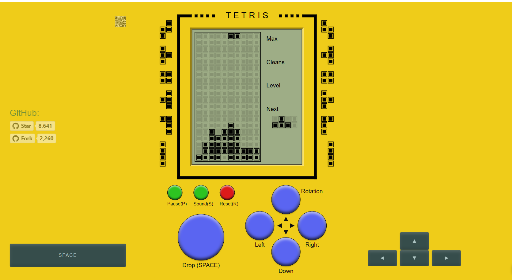

```markdown
I (M24) once got a Lush 3 for a friend of mine (F26). No strings, no hidden intentions, just a thoughtful gesture because she had casually brought it up once. She's the quiet, reserved kind. The type who blushes before she speaks, so I knew she'd never buy it for herself. I just wanted her to feel what she deserved to feel.

Weeks passed. Out of nowhere, she messaged me one evening after work:  
_"Wanna control it for me tonight?"_

I said yes. Not because of the thrill, but because she trusted me. She felt safe enough to hand over that part of herself. That night, when we both arrived at home, I got her text saying, _“I’m ready,”_ and in that moment, something shifted.

We were on a voice call. I started gently. She let me guide her, where to place it, how to breathe, when to stay still. But gentleness wasn’t what she wanted… not entirely. She wanted to let go. And when she did... my God. The shivers, the sounds, the tension in her voice... it was beautiful. Real, intimate in a way I hadn’t expected.



But the real surprise came the next day.

She walked in, eyes lowered, flushed like a cherry blossom in spring. Wouldn’t look at me. I thought I’d overstepped. I didn’t know how to bring back our ease, our usual banter. Until she whispered, with a smirk hiding behind her blush:  
**“Can you keep me on my toes… but not make me scream at work, please?”**

And that’s when I knew—she wasn’t awkward. She was hooked.

To anyone exploring this dynamic: don’t just stop at the bedroom. Explore more. The teasing, the timing, the emotional dance. There's a whole world of sensations when you add trust, anticipation, and a little mischief into the mix.

Let it be playful. Let it be slow. Let it be wild.  
But above all, let it be respectful. That’s where the magic lies.
```